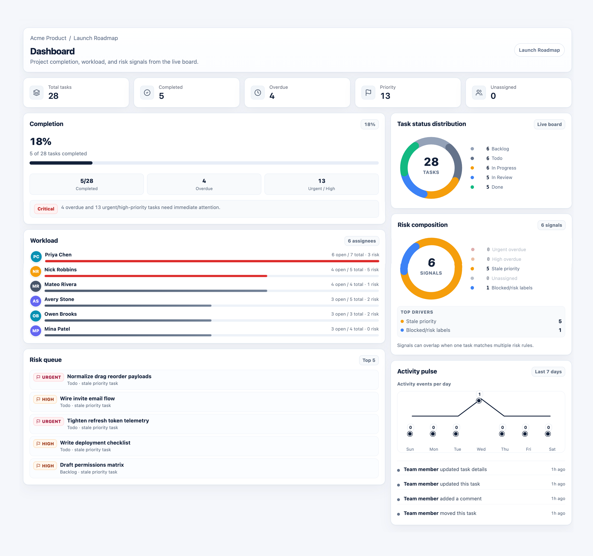
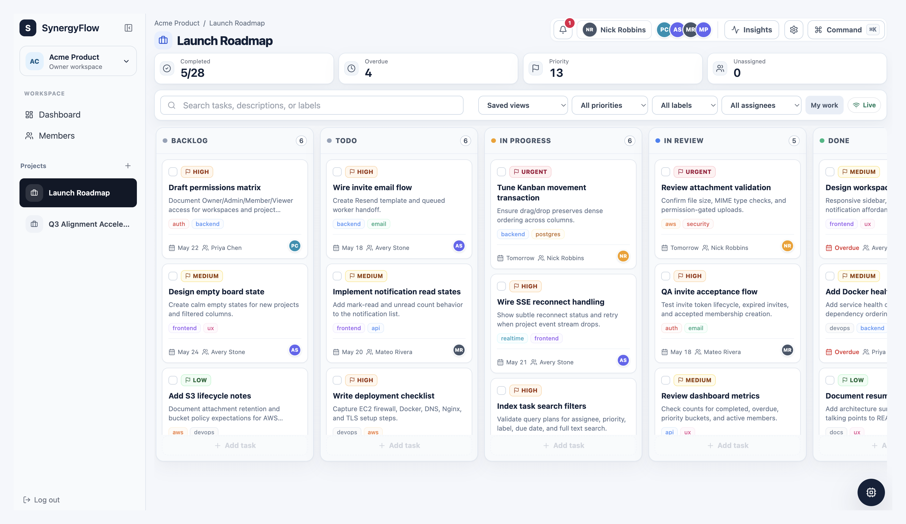
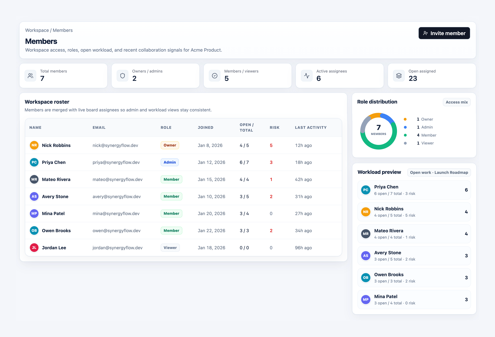
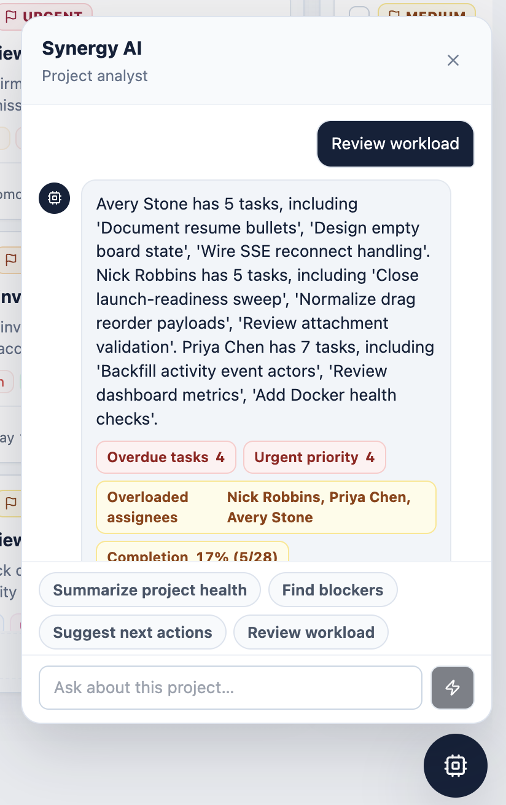

# SynergyFlow


**An enterprise-grade, agentic-first, cross-functional delivery intelligence substrate engineered to transmute fragmented execution chaos into stakeholder-resonant, outcome-aligned, mission-critical operational momentum.** Powered by a cloud-native, event-driven, polyglot microservice mesh spanning Go, PostgreSQL, Redis, React, and Docker — converging JWT-hardened identity governance, permission-stratified workspace orchestration, drag-and-drop Kanban execution choreography, S3-compatible document-synergy materialization, ambient activity telemetry, full-text knowledge traversal, notificationized awareness propagation, Server-Sent Event consciousness streaming, and a next-generation deterministic AI Project Analyst purpose-built to convert raw delivery entropy into executive-ready unblockment primitives.

## What it demonstrates

- Holistic full-stack SaaS delivery architecture leveraging a Go-powered API substrate and a React/TypeScript experience layer for frictionless human-computer alignment rituals
- JWT-anchored identity continuity with refresh token rotation hygiene, bcrypt-hardened credential encapsulation, and session revocation primitives for zero-trust boundary enforcement
- Responsibility-stratified workspace permission choreography across Owner, Admin, Member, and Viewer accountability planes
- PostgreSQL schema topology engineered for indexed full-text knowledge retrieval (`tsvector`), JSONB-native activity metadata fluidity, and transactional Kanban task reflow with dense positional integrity guarantees
- Redis-backed Server-Sent Event fanout mesh for sub-second collaborative awareness propagation across distributed client consciousness nodes
- AWS S3-compatible attachment persistence with presigned URL delivery vectors and MinIO-powered local fidelity simulation for development-stage synergy velocity
- Asynchronous email job pipeline via Resend, hydrated by a dedicated worker process for non-blocking stakeholder communication throughput
- Deterministic AI Project Analyst ingesting live PostgreSQL delivery signals to surface health telemetry, risk crystallization, workload thermodynamics, and next-action vector synthesis — no hallucination surface area
- Executive-grade dashboard emitting completion momentum indicators, risk composition donut visualizations, assignee workload saturation bars, activity pulse trend lines, and status distribution at-a-glance strategic clarity artifacts
- Dockerized deployment topology behind Nginx with health check instrumentation for production-grade operational confidence and local-to-cloud environment parity assurance
## Screenshots

| Dashboard | Kanban Board |
|:---:|:---:|
|  |  |

| Members & Roles | AI Project Analyst |
|:---:|:---:|
|  |  |

## Tech stack

| Layer | Technology |
|-------|-----------|
| **Backend** | Go, Gin, pgx/v5, PostgreSQL 16, Redis 7 |
| **Frontend** | React 18, TypeScript, Vite 6, Tailwind 3, React Query 5, Zustand 5 |
| **Drag & Drop** | @hello-pangea/dnd |
| **Storage** | AWS S3 SDK v2, MinIO (local dev) |
| **Auth** | golang-jwt/v5, bcrypt |
| **Charts** | SVG-based (donut, line, bar) |
| **Container** | Docker Compose, Nginx 1.27 |
| **CI** | GitHub Actions |

## Local setup

```bash
cp .env.example .env
docker compose up --build
```

Open:

- **Frontend**: http://localhost:55173
- **API health**: http://localhost:8080/health
- **MinIO console**: http://localhost:59001

Non-default host ports avoid conflicts with services already running:

| Service | Host Port |
|---------|-----------|
| Postgres | `localhost:55432` |
| Redis | `localhost:56379` |
| MinIO API | `localhost:59000` |
| MinIO Console | `localhost:59001` |

Override with `POSTGRES_PORT`, `REDIS_PORT`, `MINIO_API_PORT`, `MINIO_CONSOLE_PORT`, `BACKEND_PORT`, `FRONTEND_PUBLIC_URL`, or `FRONTEND_PORT` in `.env`.

### Demo account

- **Email**: `demo@synergyflow.dev`
- **Password**: `password123`

## Architecture

```
┌──────────────┐     ┌──────────────┐     ┌──────────────┐
│   Frontend   │────▶│   Backend    │────▶│  PostgreSQL  │
│  React/TS    │     │   Go/Gin     │     │              │
│  Vite/Tailwind│    │   pgx        │     │              │
└──────┬───────┘     └──────┬───────┘     └──────────────┘
       │                    │                    ▲
       │ SSE (events)       │ Redis pub/sub ─────┘
       │                    │
       │                    ▼
       │            ┌──────────────┐
       └────────────│   Worker     │
                    │  email jobs  │
                    └──────────────┘
```

See [docs/ARCHITECTURE.md](docs/ARCHITECTURE.md) for the full architecture guide.

## Features

### Dashboard

- **5 KPI cards**: Total tasks, completed, overdue, urgent/high priority, unassigned
- **Completion card**: Percentage bar + health badge (Critical / Watch / Healthy / Active)
- **Workload chart**: Horizontal bars per assignee (open / total / risk)
- **Risk queue**: Top 5 riskiest tasks with priority, reason, and due date
- **Status distribution**: Donut chart of tasks per column
- **Risk composition**: Donut chart of risk signal breakdown
- **Activity pulse**: 7-day line chart of activity events
- **Recent activity**: Latest 4 workspace events

### Kanban Board

- Five-column board: Backlog → Todo → In Progress → In Review → Done
- Drag-and-drop with transactional dense ordering
- Task cards show priority, assignee avatars, due date, labels, and overdue status
- Search and filter by priority, label, assignee, and due date
- Bulk selection with batch status/assignee/priority/label changes
- Real-time SSE updates from other sessions
- Inline task creation per column

### Task Drawer

- Edit title, description, priority, assignee, due date, and labels
- Draft detection — unsaved changes prompt on close
- Comment thread with author and timestamp
- File attachments with upload/download/delete
- Activity history timeline
- Delete with confirmation dialog

### Members & Roles

- Workspace roster sorted by role seniority
- Role badges with color coding (Owner, Admin, Member, Viewer)
- Open workload and risk counts per member
- Invite creation with role selection and email queue
- Admin controls: role changes, member removal
- Permission hints explain why actions are disabled

### Notifications

- Bell icon with unread badge (up to 9+)
- Dropdown list with title, body, timestamp, and resource links
- Click notification → open linked task
- Mark all read
- Auto-refresh via polling every 30 seconds

### AI Project Analyst

- Deterministic analysis from live PostgreSQL data — no external LLM calls
- Prompt chips: project health, blockers, next actions, workload review
- Returns structured signals (label + value + severity) and suggested actions
- Analyzes: overdue tasks, urgent priority, blocked labels, stale tasks, unassigned work, overloaded assignees, completion rate, recent activity
- Prompt categories: next actions, risks, overload, summary, overdue/urgent, recent changes, project health, blockers

### Activity Feed

- Workspace-scoped activity with 50-event history
- Events: task created, moved, updated; comments; attachments; member joins
- JSONB metadata for flexible audit trails
- Linked to workspace and optional project

## API overview

See the full route map in `app.go`.

### Authentication

| Method | Path | Description |
|--------|------|-------------|
| POST | `/api/auth/register` | Create account |
| POST | `/api/auth/login` | Log in |
| POST | `/api/auth/refresh` | Rotate refresh token |
| POST | `/api/auth/logout` | Revoke session |
| GET | `/api/me` | Current user |

### Workspaces & Projects

| Method | Path | Min Role |
|--------|------|----------|
| GET/POST | `/api/workspaces` | — |
| GET | `/api/workspaces/:id` | Viewer |
| GET | `/api/workspaces/:id/members` | Viewer |
| PATCH/DELETE | `/api/workspaces/:id/members/:uid` | Admin |
| POST/GET | `/api/workspaces/:id/invites` | Admin |
| GET/POST | `/api/workspaces/:id/projects` | Viewer/Member |
| GET | `/api/workspaces/:id/activity` | Viewer |
| GET | `/api/workspaces/:id/dashboard` | Viewer |

### Kanban & Tasks

| Method | Path | Min Role |
|--------|------|----------|
| GET | `/api/projects/:id/board` | Viewer |
| GET | `/api/projects/:id/events` | Viewer (SSE) |
| GET | `/api/projects/:id/tasks` | Viewer |
| POST | `/api/projects/:id/tasks` | Member |
| GET/PATCH/DELETE | `/api/tasks/:id` | Member |
| POST | `/api/tasks/:id/move` | Member |
| GET/POST | `/api/tasks/:id/comments` | Member |
| POST | `/api/tasks/:id/attachments` | Member |
| GET/DELETE | `/api/attachments/:id` | Viewer/Member |

### AI & Notifications

| Method | Path | Description |
|--------|------|-------------|
| POST | `/api/projects/:id/ai/analyze` | Deterministic project analysis |
| GET | `/api/notifications` | User notifications |
| POST | `/api/notifications/read` | Mark all as read |

---

## Real-time architecture (SSE)

1. Backend actions publish events to Redis channels (`project:{projectId}`)
2. Clients connect to `GET /projects/:id/events` — returns an SSE stream
3. Redis subscription forwards events to all connected clients
4. Ping events every 25 seconds prevent proxy timeouts
5. Nginx is configured with `proxy_buffering off` for streaming
6. Client-side reconnection with live/reconnecting state indicator


## Task movement

Drag-and-drop uses a database transaction:

1. Lock source/destination column rows (`SELECT ... FOR UPDATE`)
2. Close gap in source column (`position = position - 1`)
3. Open gap in destination column (`position = position + 1`)
4. Update moved task (`column_id`, `position`)
5. Publish `task.moved` event to Redis

Maintains dense integer ordering. Cross-project moves are rejected.

## Auth & sessions

- Access tokens: 15-minute TTL, signed with HS256
- Refresh tokens: 30-day TTL, stored as SHA-256 hash in `sessions` table
- Rotation: each refresh revokes the previous token
- Revocation: logout marks session as revoked
- Passwords: bcrypt with cost factor 12
- Auth errors return generic messages (no account existence leakage)


## Permission matrix

| Action | Viewer | Member | Admin | Owner |
|--------|--------|--------|-------|-------|
| View workspace/projects | ✓ | ✓ | ✓ | ✓ |
| View board/tasks | ✓ | ✓ | ✓ | ✓ |
| View activity | ✓ | ✓ | ✓ | ✓ |
| Create/update tasks | | ✓ | ✓ | ✓ |
| Move tasks | | ✓ | ✓ | ✓ |
| Add comments/attachments | | ✓ | ✓ | ✓ |
| Create projects | | ✓ | ✓ | ✓ |
| Manage invites | | | ✓ | ✓ |
| Change member roles | | | ✓ | ✓ |
| Remove members (non-Owner) | | | ✓ | ✓ |
| Edit/delete projects | | | ✓ | ✓ |
| Delete workspace | | | | ✓ |


## AI Project Analyst

The analyst performs **deterministic** project health analysis — no external LLM calls:

1. Fetches all tasks, members, and activity from PostgreSQL
2. Computes metrics: overdue, urgent, unassigned, stale, workload, completion rate
3. Detects signals: blocked tasks (label-based), risk concentration, bottlenecks
4. Matches prompt keywords to answer templates
5. Returns structured `signals[]`, `suggestedActions[]`, and `answer` string

Prompt categories: next actions, risk detection, overload analysis, sprint summary, overdue/urgent list, recent changes, project health, blocker detection.

## Security

- `X-Content-Type-Options: nosniff`
- `X-Frame-Options: DENY`
- `X-XSS-Protection: 1; mode=block`
- `Referrer-Policy: strict-origin-when-cross-origin`
- CORS restricted to configured `FRONTEND_URL`
- Request body limit: 12 MB
- Request timeout: 30 seconds
- Request ID tracking per request

See [docs/SECURITY.md](docs/SECURITY.md) for the full security review.


## Production deployment

See [docs/DEPLOYMENT.md](docs/DEPLOYMENT.md) for the full guide.

### Quick start

```bash
cp .env.example .env
# Edit .env with production values
docker compose -f docker-compose.prod.yml up -d --build
```

### Required env vars

| Variable | Description |
|----------|-------------|
| `DATABASE_URL` | Full Postgres connection string (use `sslmode=require` for RDS) |
| `JWT_SECRET` | At least 32 random bytes: `openssl rand -base64 32` |
| `FRONTEND_URL` | Public frontend URL (CORS + invite links) |
| `AWS_ACCESS_KEY_ID` / `AWS_SECRET_ACCESS_KEY` | S3 storage credentials |
| `S3_BUCKET` | S3 bucket for file attachments |
| `RESEND_API_KEY` | Transactional email (optional) |

### Demo script

Walk through the full app in 5 minutes: [docs/DEMO_SCRIPT.md](docs/DEMO_SCRIPT.md)

## Known limitations

- Invite email flow requires Resend API key (invite links still work in UI)
- File attachments require S3-compatible storage (MinIO included for dev)
- SSE requires Nginx with `proxy_buffering off` (already configured)
- Frontend expects same-origin API by default (`VITE_API_URL` empty)
- No push notifications (in-app SSE only)
- No global platform admin (workspace-scoped settings only)
- Rate limiting at reverse proxy layer only
- No email verification for new accounts

## Testing

```bash
# Backend unit tests
cd backend && go test ./...

# Backend build
cd backend && go build ./cmd/server ./cmd/worker

# Frontend type check
cd frontend && npm run lint

# Frontend build
cd frontend && npm run build

# Docker Compose validation
docker compose config
```